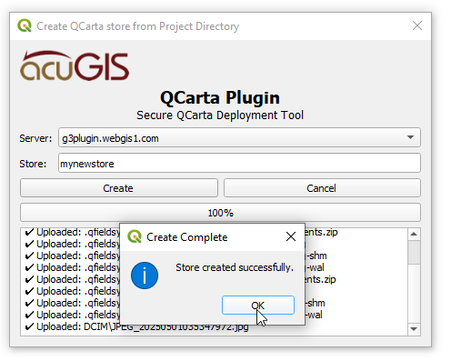
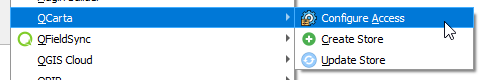
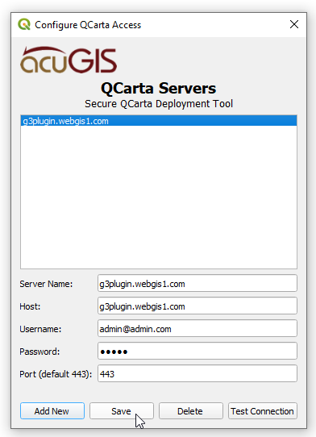
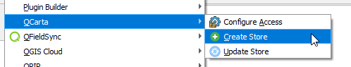
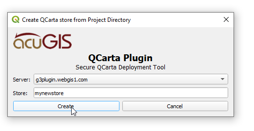
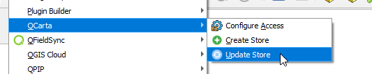

# QCarta QGIS Plugin

AcuGIS QCarta Plugin for QGIS is a plugin for tranfering contents of a QGIS Project to a QCarta store.

## Features

- Store multiple servers access details
- Transfer entrire directory contents, including sub folders.
- Uses chunks for uploads, to support very large files

## Uses:

- Any case in which you wish to transfer project directory to a QCarta server

## Installation

Download qcarta_qgis_plugin.zip to your desktop

In QGIS, go to Plugins > Manage and Install Plugins and click on "Install from Zip" in left menu.

Browse to location where you saved qcarta_qgis_plugin.zip and then click "Install Plugin"

Once installed, you should see the Plugins menu.

Plugin location /home/USERANME/.local/share/QGIS/QGIS3/profiles/default/python/plugins/qcarta_qgis_plugin

## Configure Servers:

Go to:

Enter the information

- Begin by selecting 'Configure Access':

- Click Add to add server(s).

- Enter Server information

- Click Save.

## Upload to QCarta

Go to 'Create Store'

Select the Server you wish to upload to.
Select the Store you wish to upload to.
Click Upload

.. note::
    Plugin uses file modification time to decide, if a file has to be uploaded.
    

A success message will be displayed up completion.

## Toolbar Icons:

Confifure Access:

Create Store:

Update Store:

## Issues

Report all issues here
