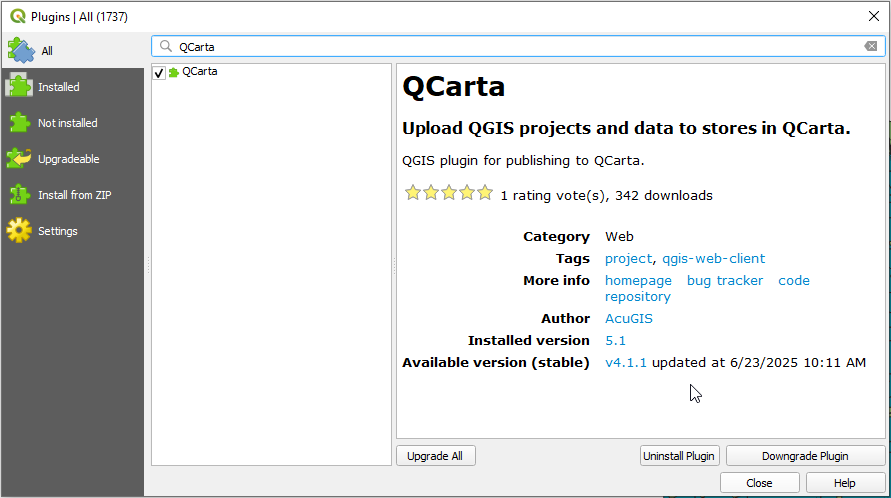
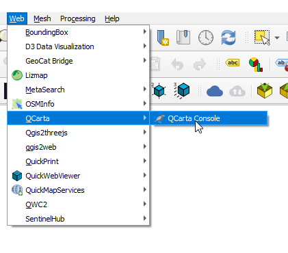
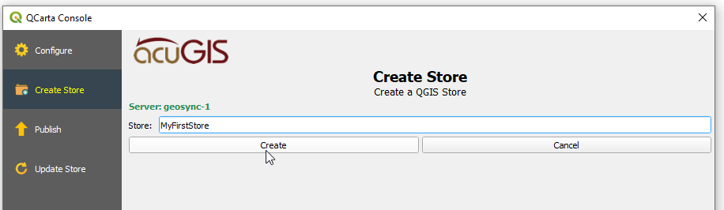

# QCarta QGIS Plugin

Installation
==================

The plugin is available via the QGIS Plugin Repository

This is the recommended way to install it.

.. note::
    The plugin is NOT a requirement for publishing to QCarta, you can publish directly via QCarta admin interface as well.

Usage
==================
  
Once installed, go to Web > QCarta > QCarta Console:

Click Add New Server

Enter your QCarta server details and click Test Connection

When Connection test passes, click Save

Go to the Store tab.

Give your Store a name and click Create

This will upload the QGIS project directory and create the Store

Click the Publish tab

Select the Store you wish to Publish from the dropdown

Select your map options and will in the required fields.

Click Create

You'll see a message that your Store has now been Published

View the map

.. note::
    Just as you can do all above without using the Plugin, you can also edit Maps you have published directly in QCarta as well.
    

Update Store
==================

You can update an existing Store using the Update Store tab.

## Issues

Report all issues here
