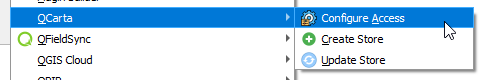

**********************
QCarta QGIS Plugin
**********************

.. contents:: Table of Contents
Installation
==================

The plugin is available via the QGIS Plugin Repository

This is the recommended way to install it.

Manual Installation
==================

Download qcarta_qgis_plugin.zip to your desktop

In QGIS, go to Plugins > Manage and Install Plugins and click on "Install from Zip" in left menu.

Browse to location where you saved acugis_sftp_tool.zip and then click "Install Plugin"

.. image:: install-1.png

Once installed, you should see the Plugins menu.

Usage
==================
  
Begin by selecting Configure SFTP servers:  

Click Add to add server(s).

.. image:: qcarta3.png

Click Save.

Go to Create Store

.. image:: qcarta02.png

Select the Server you wish to upload to.  

.. warning::
    The entire QGIS Project directory will be uploaded.

Click Upload

A success message will be displayed up completion.

.. image:: qcarta6.png

.. note::
    If files exist, you will prompted if you wish to overwrite files.
    

Update Store
==================

You can update an existing Store using the Update Store function

.. image:: qcarta03.png

Select the Server and Store:

